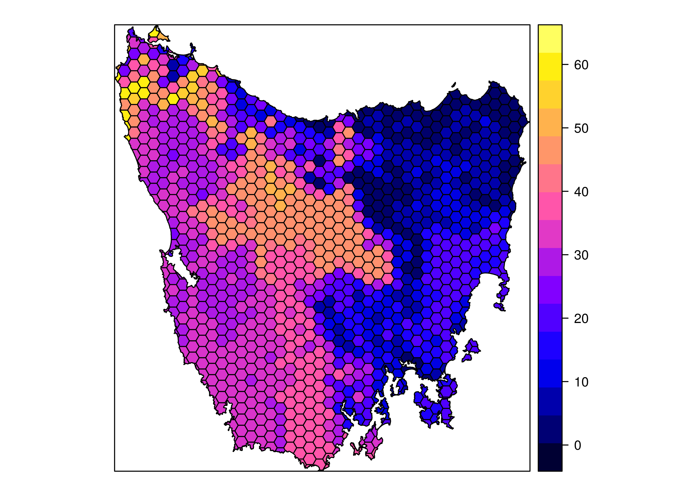
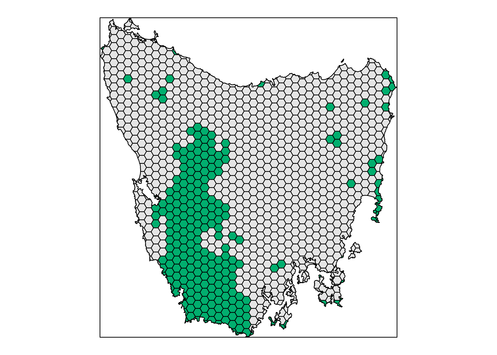
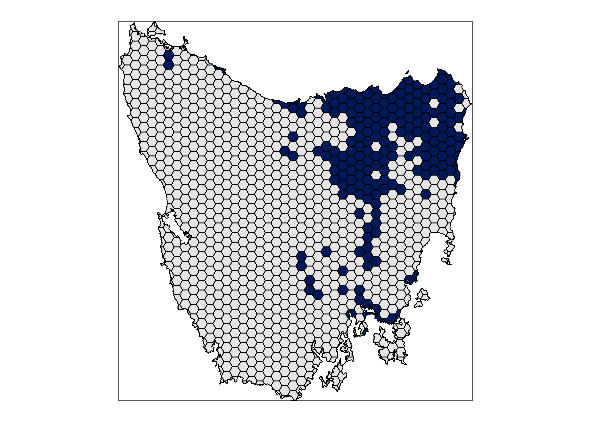
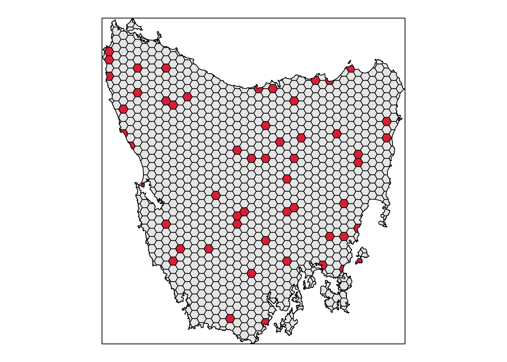
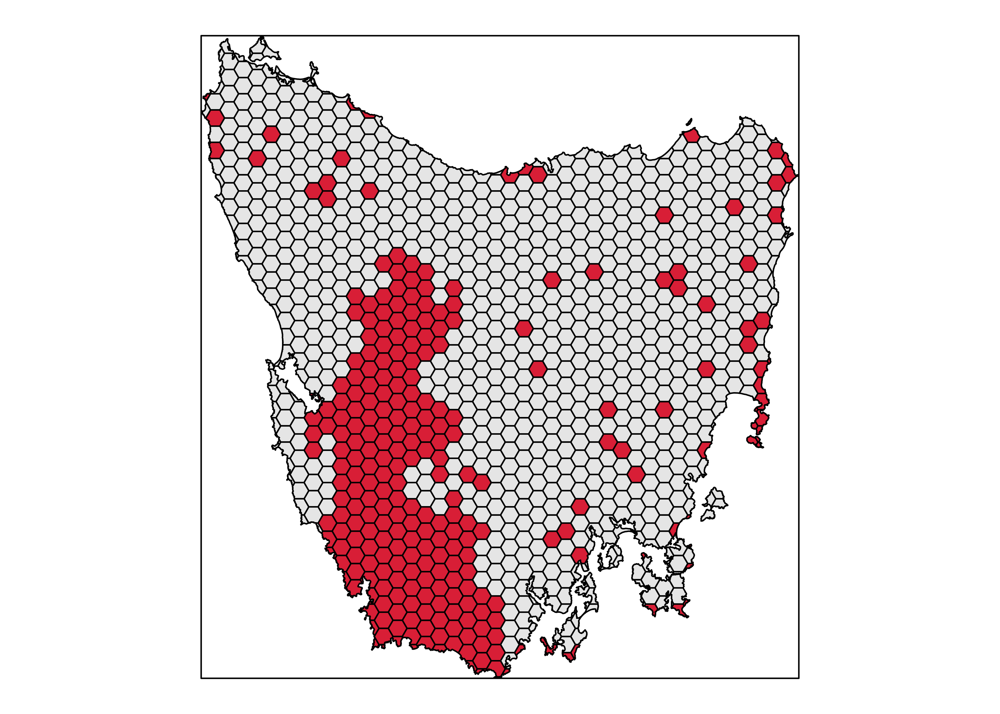
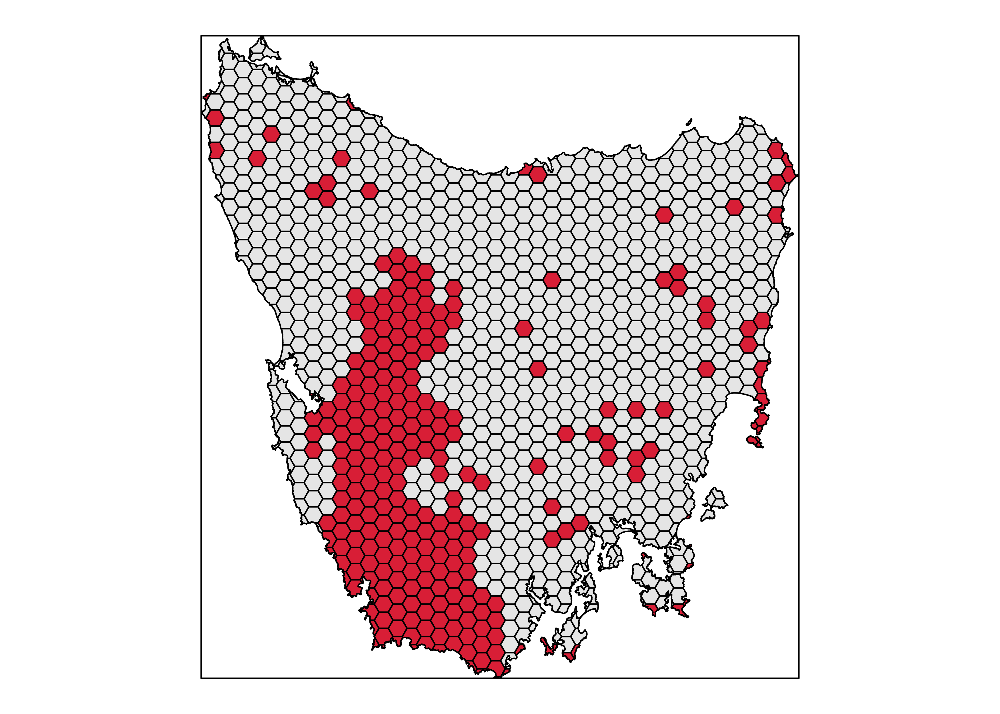
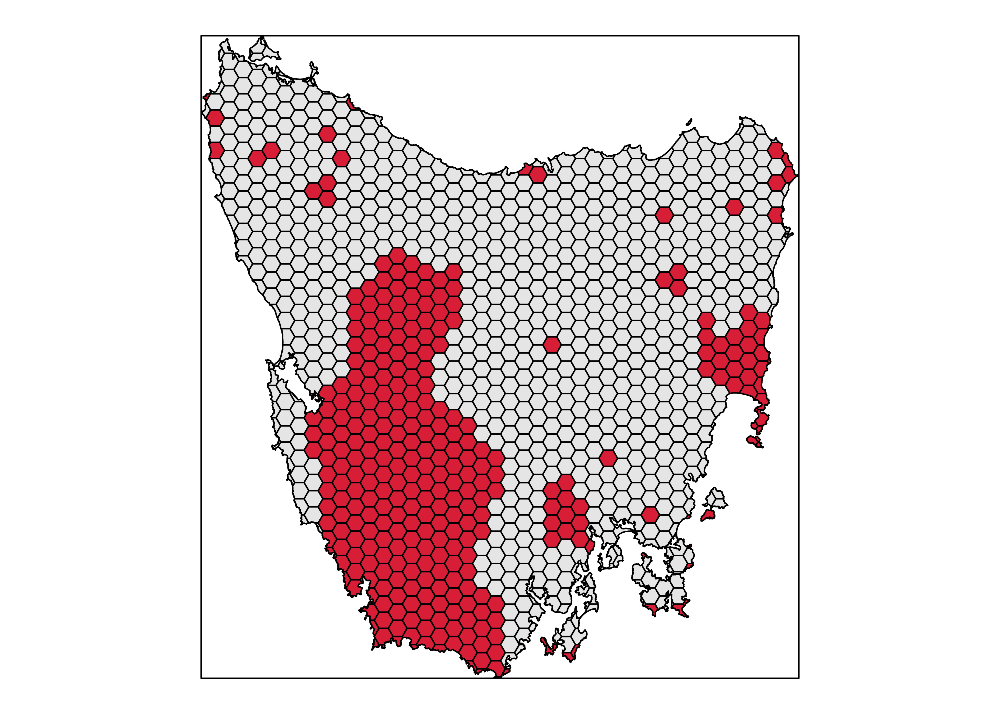
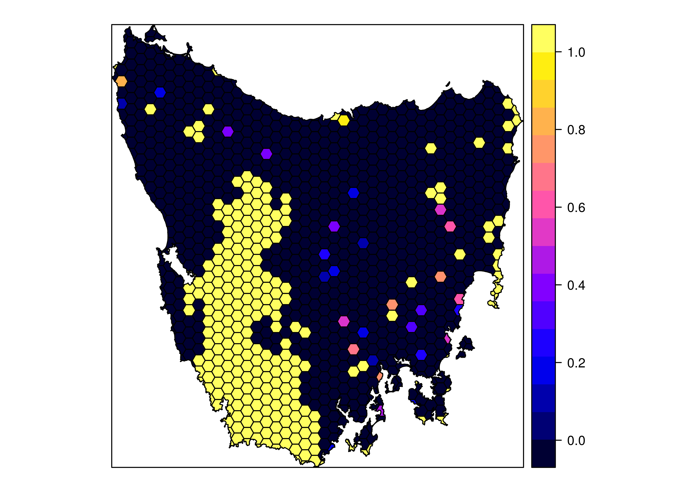
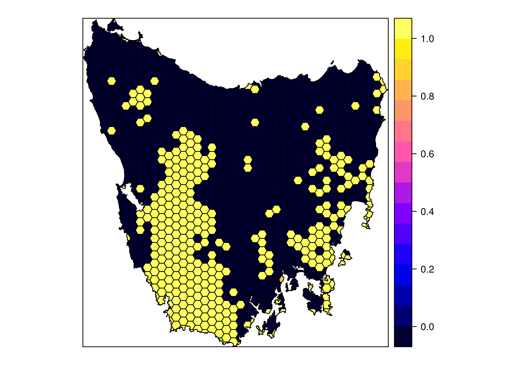
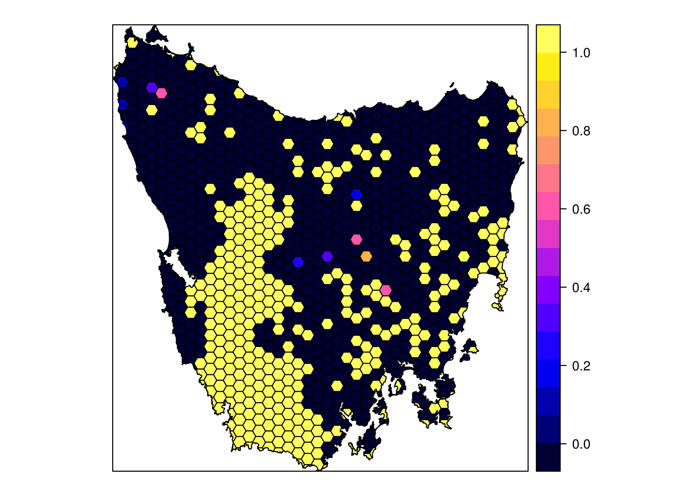

```r
# load packages
library(prioritizr)
```

```
## Loading required package: raster
```

```
## Loading required package: sp
```

```
## Loading required package: proto
```

```r
library(prioritizrdata)

# import data
data(tas_pu, package = "prioritizrdata")
data(tas_features, package = "prioritizrdata")

# add locked_out field
tas_pu$locked_out <- tas_pu$cost < quantile(tas_pu$cost, 0.2)[[1]]
tas_pu$locked_out <- tas_pu$locked_out & (!tas_pu$locked_in)

# set budget
budget <- ceiling(sum(tas_pu$cost[tas_pu$locked_in]) +
                  sum(tas_pu$cost[!tas_pu$locked_in]) * 0.1)

print(budget)
```

```
## [1] 10469
```


```r
spplot(tas_pu, "cost", main = NULL, colorkey = TRUE)
```

<!-- -->


```r
spplot(tas_pu, "locked_in", col.regions = c("grey90", "#01AE6E"), main = NULL,
       colorkey = FALSE)
```

<!-- -->


```r
spplot(tas_pu, "locked_out", col.regions = c("grey90", "#00195B"), main = NULL,
       colorkey = FALSE)
```

<!-- -->


```r
# create problem
p <- problem(tas_pu, tas_features, "cost") %>%
     add_min_set_objective() %>%
     add_relative_targets(0.1) %>%
     add_binary_decisions() %>%
     add_gurobi_solver(gap = 0)

# solve problem
s <- solve(p)
```

```
## Optimize a model with 62 rows, 1130 columns and 1560 nonzeros
## Variable types: 0 continuous, 1130 integer (1130 binary)
## Coefficient statistics:
##   Matrix range     [1e-02, 7e-01]
##   Objective range  [2e-01, 6e+01]
##   Bounds range     [1e+00, 1e+00]
##   RHS range        [2e-03, 2e+00]
## Found heuristic solution: objective 2923.44
## Presolve removed 7 rows and 324 columns
## Presolve time: 0.01s
## Presolved: 55 rows, 806 columns, 1474 nonzeros
## Found heuristic solution: objective 1861.8029484
## Variable types: 0 continuous, 806 integer (806 binary)
## Presolved: 55 rows, 806 columns, 1474 nonzeros
## 
## 
## Root relaxation: objective 1.109977e+03, 81 iterations, 0.00 seconds
## 
##     Nodes    |    Current Node    |     Objective Bounds      |     Work
##  Expl Unexpl |  Obj  Depth IntInf | Incumbent    BestBd   Gap | It/Node Time
## 
##      0     0 1109.97666    0   45 1861.80295 1109.97666  40.4%     -    0s
## H    0     0                    1409.5043990 1109.97666  21.3%     -    0s
## H    0     0                    1368.3389336 1109.97666  18.9%     -    0s
##      0     0 1191.69516    0   67 1368.33893 1191.69516  12.9%     -    0s
## H    0     0                    1297.5501015 1191.69516  8.16%     -    0s
## H    0     0                    1291.3683105 1191.69516  7.72%     -    0s
##      0     0 1203.70019    0   77 1291.36831 1203.70019  6.79%     -    0s
##      0     0 1204.92263    0   80 1291.36831 1204.92263  6.69%     -    0s
##      0     0 1205.14029    0   81 1291.36831 1205.14029  6.68%     -    0s
##      0     0 1205.14497    0   82 1291.36831 1205.14497  6.68%     -    0s
##      0     0 1224.66347    0   69 1291.36831 1224.66347  5.17%     -    0s
##      0     0 1226.17222    0   87 1291.36831 1226.17222  5.05%     -    0s
##      0     0 1226.79040    0   91 1291.36831 1226.79040  5.00%     -    0s
##      0     0 1226.80150    0   90 1291.36831 1226.80150  5.00%     -    0s
##      0     0 1239.58613    0   79 1291.36831 1239.58613  4.01%     -    0s
##      0     0 1240.29587    0   89 1291.36831 1240.29587  3.95%     -    0s
##      0     0 1240.97346    0   90 1291.36831 1240.97346  3.90%     -    0s
##      0     0 1241.21034    0   90 1291.36831 1241.21034  3.88%     -    0s
##      0     0 1243.42366    0   91 1291.36831 1243.42366  3.71%     -    0s
##      0     2 1243.56246    0   91 1291.36831 1243.56246  3.70%     -    0s
## H  510   372                    1289.3775737 1251.09811  2.97%  14.4    1s
## H  510   353                    1287.1387837 1251.09811  2.80%  14.4    1s
## H  512   337                    1287.0824807 1251.09811  2.80%  14.3    1s
## H  736   357                    1274.4088496 1258.77234  1.23%  18.8    2s
## H  993   337                    1272.3312691 1261.23389  0.87%  20.0    2s
## H 1126   318                    1272.2062879 1261.89447  0.81%  20.4    2s
## H 1272   251                    1270.4058038 1263.23901  0.56%  20.2    2s
## H 1474   261                    1270.2357945 1264.13028  0.48%  19.7    2s
## H 1478   263                    1270.1750559 1264.23280  0.47%  19.7    2s
## * 2157   277              32    1270.0595355 1266.70987  0.26%  19.3    3s
## * 2595   213              33    1269.8912984 1267.74529  0.17%  18.6    4s
## 
## Cutting planes:
##   Gomory: 2
##   Cover: 47
##   MIR: 68
##   StrongCG: 29
##   Flow cover: 48
##   Zero half: 8
## 
## Explored 2997 nodes (52771 simplex iterations) in 4.36 seconds
## Thread count was 1 (of 4 available processors)
## 
## Solution count 10: 1269.89 1270.06 1270.18 ... 1287.14
## 
## Optimal solution found (tolerance 0.00e+00)
## Best objective 1.269891298423e+03, best bound 1.269891298423e+03, gap 0.0000%
```

```r
# plot solution
spplot(s, "solution_1", col.regions = c("grey90", "#D81E36"), main = NULL,
       colorkey = FALSE)
```

<!-- -->


```r
# create problem
p <- problem(tas_pu, tas_features, "cost") %>%
     add_min_set_objective() %>%
     add_relative_targets(0.1) %>%
     add_locked_in_constraints("locked_in") %>%
     add_binary_decisions() %>%
     add_gurobi_solver(gap = 0)

# solve problem
s <- solve(p)
```

```
## Optimize a model with 62 rows, 1130 columns and 1560 nonzeros
## Variable types: 0 continuous, 1130 integer (1130 binary)
## Coefficient statistics:
##   Matrix range     [1e-02, 7e-01]
##   Objective range  [2e-01, 6e+01]
##   Bounds range     [1e+00, 1e+00]
##   RHS range        [2e-03, 2e+00]
## Found heuristic solution: objective 9887.26
## Presolve removed 33 rows and 834 columns
## Presolve time: 0.00s
## Presolved: 29 rows, 296 columns, 535 nonzeros
## Found heuristic solution: objective 9049.6721583
## Variable types: 0 continuous, 296 integer (296 binary)
## Presolved: 29 rows, 296 columns, 535 nonzeros
## 
## 
## Root relaxation: objective 8.927880e+03, 43 iterations, 0.00 seconds
## 
##     Nodes    |    Current Node    |     Objective Bounds      |     Work
##  Expl Unexpl |  Obj  Depth IntInf | Incumbent    BestBd   Gap | It/Node Time
## 
##      0     0 8927.88005    0   17 9049.67216 8927.88005  1.35%     -    0s
## H    0     0                    8960.0146241 8927.88005  0.36%     -    0s
## H    0     0                    8953.9351080 8927.88005  0.29%     -    0s
## H    0     0                    8951.8757990 8927.88005  0.27%     -    0s
## H    0     0                    8941.5553815 8927.88005  0.15%     -    0s
##      0     0 8938.29590    0   14 8941.55538 8938.29590  0.04%     -    0s
##      0     0 8938.29590    0   12 8941.55538 8938.29590  0.04%     -    0s
##      0     0 8938.67268    0   15 8941.55538 8938.67268  0.03%     -    0s
##      0     0 8938.67268    0    8 8941.55538 8938.67268  0.03%     -    0s
##      0     0 8939.37776    0   12 8941.55538 8939.37776  0.02%     -    0s
##      0     0 8939.37776    0    8 8941.55538 8939.37776  0.02%     -    0s
## H    0     0                    8940.7420726 8939.37776  0.02%     -    0s
##      0     0 8939.49854    0   11 8940.74207 8939.49854  0.01%     -    0s
##      0     0 8940.65762    0    2 8940.74207 8940.65762  0.00%     -    0s
## 
## Cutting planes:
##   Cover: 6
##   MIR: 1
## 
## Explored 1 nodes (178 simplex iterations) in 0.05 seconds
## Thread count was 1 (of 4 available processors)
## 
## Solution count 7: 8940.74 8941.56 8951.88 ... 9467.37
## 
## Optimal solution found (tolerance 0.00e+00)
## Best objective 8.940742072619e+03, best bound 8.940742072619e+03, gap 0.0000%
```

```r
# plot solution
spplot(s, "solution_1", col.regions = c("grey90", "#D81E36"), main = NULL,
       colorkey = FALSE)
```

<!-- -->


```r
# create problem
p <- problem(tas_pu, tas_features, "cost") %>%
     add_min_set_objective() %>%
     add_relative_targets(0.1) %>%
     add_locked_in_constraints("locked_in") %>%
     add_locked_out_constraints("locked_out") %>%
     add_binary_decisions() %>%
     add_gurobi_solver(gap = 0)

# solve problem
s <- solve(p)
```

```
## Optimize a model with 62 rows, 1130 columns and 1560 nonzeros
## Variable types: 0 continuous, 1130 integer (1130 binary)
## Coefficient statistics:
##   Matrix range     [1e-02, 7e-01]
##   Objective range  [2e-01, 6e+01]
##   Bounds range     [1e+00, 1e+00]
##   RHS range        [2e-03, 2e+00]
## Found heuristic solution: objective 9745.2
## Presolve removed 33 rows and 922 columns
## Presolve time: 0.00s
## Presolved: 29 rows, 208 columns, 380 nonzeros
## Found heuristic solution: objective 9134.1484174
## Variable types: 0 continuous, 208 integer (208 binary)
## Presolved: 29 rows, 208 columns, 380 nonzeros
## 
## 
## Root relaxation: objective 8.974193e+03, 40 iterations, 0.00 seconds
## 
##     Nodes    |    Current Node    |     Objective Bounds      |     Work
##  Expl Unexpl |  Obj  Depth IntInf | Incumbent    BestBd   Gap | It/Node Time
## 
##      0     0 8974.19273    0   18 9134.14842 8974.19273  1.75%     -    0s
## H    0     0                    9002.6666824 8974.19273  0.32%     -    0s
## H    0     0                    8997.0711748 8974.19273  0.25%     -    0s
##      0     0 8989.32909    0   11 8997.07117 8989.32909  0.09%     -    0s
##      0     0 8994.00517    0   19 8997.07117 8994.00517  0.03%     -    0s
##      0     0 8995.60563    0   13 8997.07117 8995.60563  0.02%     -    0s
##      0     0 8995.61361    0   13 8997.07117 8995.61361  0.02%     -    0s
##      0     0     cutoff    0      8997.07117 8997.07117  0.00%     -    0s
## 
## Cutting planes:
##   Gomory: 1
##   Cover: 9
##   Clique: 1
##   MIR: 8
##   StrongCG: 1
## 
## Explored 1 nodes (82 simplex iterations) in 0.02 seconds
## Thread count was 1 (of 4 available processors)
## 
## Solution count 4: 8997.07 9002.67 9134.15 9402.59 
## 
## Optimal solution found (tolerance 0.00e+00)
## Best objective 8.997071174781e+03, best bound 8.997071174781e+03, gap 0.0000%
```

```r
# plot solution
spplot(s, "solution_1", col.regions = c("grey90", "#D81E36"), main = NULL,
       colorkey = FALSE)
```

<!-- -->


```r
# create problem
p <- problem(tas_pu, tas_features, "cost") %>%
     add_min_set_objective() %>%
     add_relative_targets(0.1) %>%
     add_locked_in_constraints("locked_in") %>%
     add_locked_out_constraints("locked_out") %>%
     add_boundary_penalties(1e-2, 0.5) %>%
     add_binary_decisions() %>%
     add_gurobi_solver(gap = 0)

# solve problem
s <- solve(p)
```

```
## Optimize a model with 6358 rows, 4278 columns and 14152 nonzeros
## Variable types: 0 continuous, 4278 integer (4278 binary)
## Coefficient statistics:
##   Matrix range     [1e-02, 1e+00]
##   Objective range  [1e+00, 2e+03]
##   Bounds range     [1e+00, 1e+00]
##   RHS range        [2e-03, 2e+00]
## Found heuristic solution: objective 38002.8
## Presolve removed 3264 rows and 2124 columns
## Presolve time: 0.06s
## Presolved: 3094 rows, 2154 columns, 6629 nonzeros
## Found heuristic solution: objective 33754.728311
## Variable types: 0 continuous, 2154 integer (2154 binary)
## Presolve removed 20 rows and 15 columns
## Presolved: 3074 rows, 2139 columns, 6588 nonzeros
## 
## 
## Root relaxation: objective 2.906009e+04, 1087 iterations, 0.09 seconds
## 
##     Nodes    |    Current Node    |     Objective Bounds      |     Work
##  Expl Unexpl |  Obj  Depth IntInf | Incumbent    BestBd   Gap | It/Node Time
## 
##      0     0 29060.0889    0  634 33754.7283 29060.0889  13.9%     -    0s
## H    0     0                    31614.195545 29060.0889  8.08%     -    0s
## H    0     0                    30704.847480 29060.0889  5.36%     -    0s
## H    0     0                    29992.088988 29060.0889  3.11%     -    0s
##      0     0 29311.5879    0  515 29992.0890 29311.5879  2.27%     -    0s
##      0     0 29364.2269    0  409 29992.0890 29364.2269  2.09%     -    0s
## H    0     0                    29729.173641 29364.2269  1.23%     -    0s
##      0     0 29370.7027    0  578 29729.1736 29370.7027  1.21%     -    0s
##      0     0 29372.8483    0  741 29729.1736 29372.8483  1.20%     -    0s
## H    0     0                    29614.708286 29372.8483  0.82%     -    0s
##      0     0 29373.0489    0  740 29614.7083 29373.0489  0.82%     -    0s
##      0     0 29373.6493    0  744 29614.7083 29373.6493  0.81%     -    0s
##      0     0 29373.6697    0  741 29614.7083 29373.6697  0.81%     -    0s
##      0     2 29373.7125    0  741 29614.7083 29373.7125  0.81%     -    1s
##    545    78 29592.3975   10   67 29614.7083 29494.9796  0.40%  50.1    5s
## 
## Cutting planes:
##   Gomory: 4
##   Cover: 16
##   MIR: 16
##   StrongCG: 2
##   Zero half: 4
##   Mod-K: 1
## 
## Explored 1371 nodes (65040 simplex iterations) in 8.84 seconds
## Thread count was 1 (of 4 available processors)
## 
## Solution count 7: 29614.7 29729.2 29992.1 ... 36545.2
## 
## Optimal solution found (tolerance 0.00e+00)
## Best objective 2.961470828563e+04, best bound 2.961470828563e+04, gap 0.0000%
```

```r
# plot solution
spplot(s, "solution_1", col.regions = c("grey90", "#D81E36"), main = NULL,
       colorkey = FALSE)
```

<!-- -->


```r
# create problem
p <- problem(tas_pu, tas_features, "cost") %>%
     add_min_set_objective() %>%
     add_relative_targets(0.1) %>%
     add_locked_in_constraints("locked_in") %>%
     add_locked_out_constraints("locked_out") %>%
     add_proportion_decisions() %>%
     add_gurobi_solver(gap = 0)

# solve problem
s <- solve(p)
```

```
## Optimize a model with 62 rows, 1130 columns and 1560 nonzeros
## Coefficient statistics:
##   Matrix range     [1e-02, 7e-01]
##   Objective range  [2e-01, 6e+01]
##   Bounds range     [1e+00, 1e+00]
##   RHS range        [2e-03, 2e+00]
## Presolve removed 26 rows and 813 columns
## Presolve time: 0.00s
## Presolved: 36 rows, 317 columns, 498 nonzeros
## 
## Iteration    Objective       Primal Inf.    Dual Inf.      Time
##        0    8.4801640e+03   7.314124e+00   0.000000e+00      0s
##       34    8.7426883e+03   0.000000e+00   0.000000e+00      0s
## 
## Solved in 34 iterations and 0.00 seconds
## Optimal objective  8.742688306e+03
```

```r
# plot solution
spplot(s, "solution_1", main = NULL, colorkey = TRUE)
```

<!-- -->


```r
# create problem
p <- problem(tas_pu, tas_features, "cost") %>%
     add_max_utility_objective(budget) %>%
     add_relative_targets(0.1) %>%
     add_locked_in_constraints("locked_in") %>%
     add_locked_out_constraints("locked_out") %>%
     add_proportion_decisions() %>%
     add_gurobi_solver(gap = 0)

# solve problem
s <- solve(p)
```

```
## Warning in compile.ConservationProblem(a, ...): ignoring targets since the
## maximum coverage objective function doesn't use targets
```

```
## Optimize a model with 63 rows, 1192 columns and 2752 nonzeros
## Coefficient statistics:
##   Matrix range     [1e-02, 6e+01]
##   Objective range  [1e-10, 1e+00]
##   Bounds range     [2e-02, 2e+01]
##   RHS range        [1e+04, 1e+04]
## Presolve removed 62 rows and 645 columns
## Presolve time: 0.01s
## Presolved: 1 rows, 547 columns, 547 nonzeros
## 
## Iteration    Objective       Primal Inf.    Dual Inf.      Time
##        0    1.2564462e+02   1.063327e+02   0.000000e+00      0s
##        1    4.6246412e+01   0.000000e+00   0.000000e+00      0s
## 
## Solved in 1 iterations and 0.01 seconds
## Optimal objective  4.624641160e+01
```

```r
# plot solution
spplot(s, "solution_1", main = NULL, colorkey = TRUE)
```

<!-- -->


```r
# create problem
p <- problem(tas_pu, tas_features, "cost") %>%
     add_max_features_objective(budget) %>%
     add_relative_targets(0.1) %>%
     add_locked_in_constraints("locked_in") %>%
     add_locked_out_constraints("locked_out") %>%
     add_proportion_decisions() %>%
     add_gurobi_solver(gap = 0)

# solve problem
s <- solve(p)
```

```
## Warning for adding variables: zero or small (< 1e-13) coefficients, ignored
## Optimize a model with 63 rows, 1192 columns and 2751 nonzeros
## Variable types: 1130 continuous, 62 integer (62 binary)
## Coefficient statistics:
##   Matrix range     [2e-03, 6e+01]
##   Objective range  [1e-10, 1e+00]
##   Bounds range     [1e+00, 1e+00]
##   RHS range        [1e+04, 1e+04]
## Found heuristic solution: objective 35
## Presolve removed 25 rows and 836 columns
## Presolve time: 0.00s
## Presolved: 38 rows, 356 columns, 855 nonzeros
## Variable types: 319 continuous, 37 integer (37 binary)
## Presolved: 38 rows, 356 columns, 855 nonzeros
## 
## 
## Root relaxation: objective 6.200001e+01, 29 iterations, 0.01 seconds
## 
##     Nodes    |    Current Node    |     Objective Bounds      |     Work
##  Expl Unexpl |  Obj  Depth IntInf | Incumbent    BestBd   Gap | It/Node Time
## 
## *    0     0               0      62.0000054   62.00001  0.00%     -    0s
## 
## Explored 0 nodes (29 simplex iterations) in 0.02 seconds
## Thread count was 1 (of 4 available processors)
## 
## Solution count 2: 62 35 
## 
## Optimal solution found (tolerance 0.00e+00)
## Best objective 6.200000543877e+01, best bound 6.200000543877e+01, gap 0.0000%
```

```r
# plot solution
spplot(s, "solution_1", main = NULL, colorkey = TRUE)
```

<!-- -->
